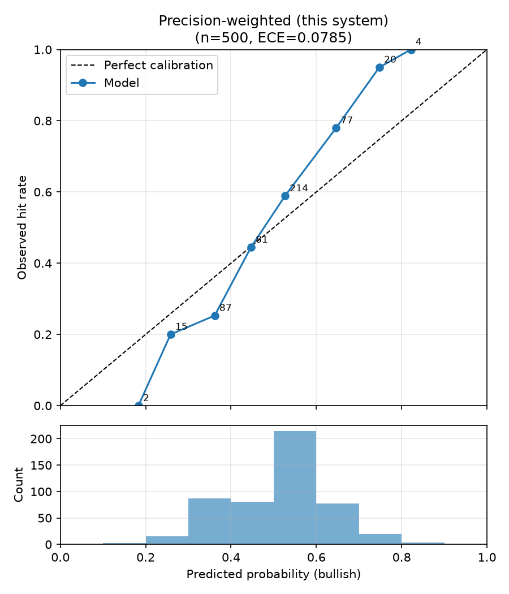
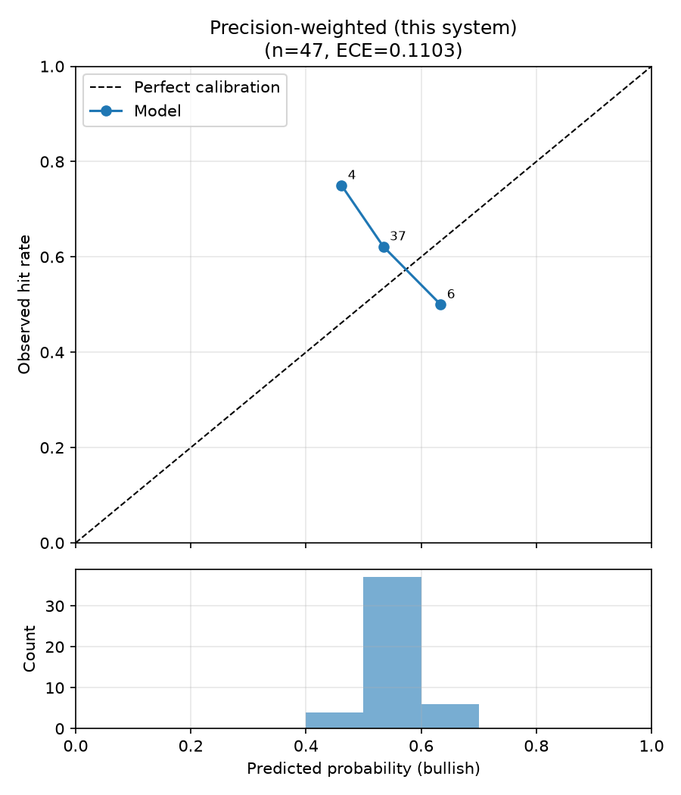

# 多代理人精度加權投資研究系統

**Precision-Weighted Multi-Agent Investment Research System**


借用神經科學**預測處理框架（predictive processing）**中的 precision
weighting 概念建構的多智能體投資研究系統：多個專家 Agent（財報、新聞事件、總經/籌碼、供應鏈）
各自產出帶信心值的判斷，仲裁層依各 Agent 的**歷史準確度**（Brier score
EMA 的倒數，即「精度」）動態加權合成投資論點——可靠度越高的來源權重越大，
系統從均等權重（loose coupling）隨證據累積收斂到以可靠來源為主導
（tight coupling）。鎖定台股 AI 供應鏈之被動元件族群。

```
 財報 Agent      新聞事件 Agent    總經/籌碼 Agent    供應鏈 Agent
 (規則式/LLM)    (規則式/LLM)      (規則式/LLM)       (規則式/LLM，知識圖譜)
      │               │                 │                  │
      └───────────────┴────────┬────────┴──────────────────┘
                  ▼
     精度加權仲裁層  final_score = Σ(precisionᵢ·κᵢ·sᵢ) / Σ precisionᵢ，κᵢ = |2pᵢ − 1|（確信度）
                  ▼
     投資論點 + 不確定性區間 + evidence trace
                  ▼ (T+20 交易日後)
     回測評估 → Brier score → 更新各 Agent 精度（EMA）→ 回饋仲裁層
```

## 核心結果

### 評估指標速覽

- **平均 Brier score**（越低越好）：每筆預測先轉成「看多機率」p（bullish
  → confidence、bearish → 1−confidence、neutral → 0.5），與實際結果
  o ∈ {0,1}（20 個交易日後報酬是否為正）計算 **(p − o)²** 再取平均。它同時
  懲罰「方向錯」與「過度自信」：0 是完美預測，**0.25 是「永遠說 50%」的
  無資訊基準**——低於 0.25 才代表模型帶有資訊。有方向的訊號信心下限為
  0.5，確保 bullish 的 p 不會落在看空側。
- **方向準確率**（越高越好）：非 neutral 的預測中，方向與實際報酬一致的
  比例。只看對錯、不看信心，與 Brier 互補。
- **ECE, Expected Calibration Error**（越低越好）：衡量「模型說 70% 時，
  是否真的有 70% 命中」。做法是把預測依機率分成 10 桶，計算每桶
  |平均預測機率 − 實際命中率|，再依樣本數加權平均。ECE = 0 代表完美校準；
  一個方向常對但總是過度自信的模型，方向準確率可以很高、ECE 卻很差。

**真實資料回測**（FinMind，5 檔被動元件 × 2024-01~2026-05，135 個預測事件，
詳見[完整版報告](docs/finmind_full_report.md)；另有 3 檔 47 事件的
[縮小版](docs/finmind_scoped_report.md)）：

| 策略 | 平均 Brier ↓ | ECE ↓ |
|---|---|---|
| Baseline A：單一 Agent（財報） | 0.2593 | 0.1174 |
| Baseline B：簡單平均合併 | **0.2540** | **0.0295** |
| 本系統：精度加權合併 | 0.2542 | 0.0297 |

三者 Brier 皆**高於** 0.25 的無資訊基準：目前的規則式 Agent 沒有預測力，
合併只是讓機率更靠近 0.5、校準更好。

**報酬層級**（long/neutral 組合、含息總報酬、扣交易成本，27 期）：所有策略
皆顯著落後 0050（期間 0050 累積 +192%，2 Agent 合併 −12% 到 +53%，單一 Agent
+23%），橫斷面 Rank IC 為負（不顯著）——規則式 Agent 目前沒有選股能力。組合報酬
對訊號公式極度敏感：修訂規格 5.2 前，3 Agent 合併曾達 +182%，但那只是多頭中
多數時間持股的結果。
詳見[完整版報告第 4 節](docs/finmind_full_report.md#4-報酬層級評估2026-10-06-新增)。

**Phase 2：加入總經/籌碼 Agent**（3 Agent，同 135 事件，詳見
[Phase 2 報告](docs/phase2_macro_report.md)）：合併 Brier 0.2540 → 0.2530；
三個 Agent 精度仍相近（比值 ≤ 1.24），精度加權依然等於或略輸簡單平均。

**LLM 判讀實驗**（地端 qwen3:8b，詳見[實驗報告](docs/llm_experiment_report.md)）：
改用 LLM 後各 Agent 精度確實拉開（比值 1.35–2.63），但 LLM 嚴重過度自信、
總經判讀一律看空，Brier 全面劣於規則式（合併 0.2805 vs 0.2538），精度加權
仍略輸簡單平均。（數字為規格 5.2 修訂前）

**Agent 層級重新校準**（詳見[校準報告](docs/calibration_report.md)）：合併前以
walk-forward 收縮校準修正各 Agent 的過度自信，LLM 合併 Brier 0.2726 → 0.2544，
但仍未低於 0.25。校準後 LLM 的精度比縮回 1.04–1.28——原本
的分化是過度自信程度不同，而非資訊量不同。目前的瓶頸在 Agent 本身的資訊量。

**新聞內文與供應鏈 Agent**（詳見[報告](docs/news_content_and_supply_chain_report.md)）：
新聞內文覆蓋率 36%（Google News 轉址無法解析），在規則式判讀下反而讓新聞 Agent
變差（Brier 0.2531 → 0.2640），改用 LLM（qwen3:8b）判讀也一樣變差（0.2718 → 0.2877）。供應鏈 Agent 的機率品質最差（0.2652），但帶來全
專案第一個為正的橫斷面 IC（+0.160，t = 1.71，未達顯著）。

**規格 5.2 修訂**（2026-10-07，詳見[校準報告第 8 節](docs/calibration_report.md#8-訊號公式修訂2026-10-07)）：
投票權重改為確信度 |2p − 1|，合併分數 = 2 × 合併機率 − 1，門檻為合併機率
0.55 / 0.45。毫無把握的 Agent 不再投票，訊號與機率一致。

**Synthetic 機制驗證**（20 seeds，來源可靠度刻意分化，詳見
[技術筆記](docs/technical_note.md)）：精度加權在 **17/20 seeds** 的
Brier 優於簡單平均。

兩組實驗合起來的結論：(1) 多 Agent 合併穩定優於單一 Agent；(2) 精度加權
相對簡單平均的增益，**只在來源可靠度實質分化時顯現**——真實回測中兩個
規則式 Agent 恰好同樣可靠（精度比僅 1.1），精度加權因此收斂到等權，這
本身是理論的正確行為而非機制失效。誠實的負結果與條件分析是本專案的
主要研究產出之一。

### 校準曲線（Reliability Diagram）怎麼看

上圖是預測機率 vs 實際命中率：**每個點代表一桶預測**（點旁數字 = 該桶
樣本數），x 座標是該桶的平均預測機率、y 座標是實際命中率；下方直方圖是
預測機率的分布。**點落在對角虛線上 = 完美校準**；點在線下方代表過度自信
（說 70% 但只中 55%），在上方代表過度保守。

**Synthetic 驗證**（500 筆預測，校準曲線緊貼對角線，ECE 0.062）：



**真實資料回測**（47 筆預測）：



讀真實資料這張圖要注意兩件事：(1) 預測機率集中在 0.4–0.7 的窄帶（下方
直方圖）——規則式 Agent 訊號溫和，合併後很少產生極端判斷，這是保守但
誠實的行為；(2) 三個桶中只有中間桶（n=37）有統計意義，左右兩桶各只有
4 和 6 筆，其偏離對角線主要是小樣本雜訊，不宜過度解讀。完整版回測
（5 檔 / 135 事件）已擴大樣本並印證同一結論，見[完整版報告](docs/finmind_full_report.md)。

## 快速開始

```bash
python3.11 -m venv .venv
.venv/bin/pip install -r requirements.txt        # Windows: .venv\Scripts\pip

# 單元測試（不需任何 API key）
.venv/bin/python -m pytest tests -q

# Synthetic 回測：模擬可靠度不同的 Agent，驗證精度加權機制
.venv/bin/python backtest/run_backtest.py --mode synthetic

# 真實資料回測（需 FinMind token：cp .env.example .env 並填入）
.venv/bin/python backtest/run_backtest.py --mode finmind \
    --tickers 2327.TW,2492.TW --start-date 2025-01-01 --step-days 21
```

輸出至 `reports/<mode>/`：比較報表（`comparison_report.md`）、校準曲線
（`calibration_*.png`）、逐筆預測（`backtest_results.csv`）。

### 執行模式與 API key

| 模式 | 需要的 key | 說明 |
|---|---|---|
| 測試 / synthetic | 無 | 完整驗證 schema、合併公式、冷啟動、指標 |
| finmind 回測 | `FINMIND_API_TOKEN`（免費註冊） | 兩個 Agent 以真實財報/新聞驅動（規則式判斷）。免費額度 600 req/hr，客戶端內建逐日快取與額度自動等待；`data_cache/` 已隨 repo 提供，重跑既有範圍不消耗額度 |
| + LLM 判讀 | `ANTHROPIC_API_KEY`，或地端 Ollama | Agent 改用 LLM 產出 signal/confidence/rationale，失敗時退回規則式。地端模型：`--llm-provider ollama --llm-model qwen3:8b`；與其他工作共用電腦時可用 `--llm-num-thread` 限制執行緒；回應快取於 `data_cache/llm/` |

## 系統設計

- **Agent 共同介面**（[agents/base.py](agents/base.py)）：`analyze(ticker, as_of_date) → AgentOutput`，
  輸出含 signal（bullish/bearish/neutral）、confidence（單次判斷的主觀信心）、
  rationale、evidence_refs、raw_features
- **precision ≠ confidence**：confidence 是 Agent 對單次判斷的信心；
  precision 是仲裁層追蹤的歷史可靠度 `1/(brier_ema + ε)`。投票權重 =
  precision × 確信度 |2p − 1|（「這個來源多可信 × 這次多有把握」），
  合併分數 = 2 × 精度加權合併機率 − 1
- **冷啟動**（[arbitrator/precision_tracker.py](arbitrator/precision_tracker.py)）：
  n < 5 的 Agent 精度取成熟記錄均值，無任何歷史時全體等權
- **走時序回測**（[backtest/run_backtest.py](backtest/run_backtest.py)）：
  精度只在 horizon 到期後更新；財報設公告遞延（月營收 40 天、季報 75 天），
  杜絕 look-ahead
- **評估**（[backtest/metrics.py](backtest/metrics.py)）：Brier score、
  Reliability Diagram、ECE、方向準確率；驗收 = 精度加權 vs 單一 Agent vs
  簡單平均的三方比較

## 專案結構

```
config/tickers.yaml     股票池與全部參數（horizon、閾值、EMA α、冷啟動門檻）
config/supply_chain_graph.json  供應鏈知識圖譜（下游為需求代理，非確認客戶）
agents/                 Agent 基底 + 財報/新聞/總經籌碼/供應鏈 Agent（LLM 可插拔）
arbitrator/             精度追蹤（Brier EMA）+ 合併公式 + Agent 層級重新校準
data/                   FinMind 抓取（快取/節流/額度等待）、含息還原價、總經/籌碼、供應鏈、新聞內文、RSS 新聞、向量庫
backtest/               walk-forward 回測 + 評估指標 + 報酬層級評估（vs 0050）
tests/                  125 個單元測試
reports/                synthetic / finmind_preliminary / finmind_scoped / finmind_full / finmind_macro / finmind_llm_qwen3 / finmind_news_content / finmind_llm_qwen3_content / finmind_supply_chain 結果
docs/                   規格、技術筆記、回測報告
notebooks/              校準分析 notebook
```

## 文件

- [技術規格](docs/spec.md) — 系統的原始設計規格（v0.1）
- [技術筆記](docs/technical_note.md) — 預測處理框架的理論對應、synthetic
  實驗、誠實分析（M5 交付物）
- [真實資料回測報告（完整版）](docs/finmind_full_report.md) — FinMind 5 檔 /
  135 事件的完整版結果與逐項解讀
- [Phase 2 回測報告](docs/phase2_macro_report.md) — 加入總經/籌碼 Agent 的
  3 Agent 結果、消融與報酬拆解
- [新聞內文與供應鏈 Agent 報告](docs/news_content_and_supply_chain_report.md) — 新聞內文
  的覆蓋率與效果、供應鏈 Agent（知識圖譜）的設計與結果
- [Agent 層級重新校準報告](docs/calibration_report.md) — 收縮校準的效果、LLM 精度分化
  的真相、synthetic 20 seeds 驗證
- [LLM 判讀實驗報告](docs/llm_experiment_report.md) — 地端 qwen3:8b 取代規則式判讀的
  結果、過度自信與方向偏誤分析
- [真實資料回測報告（縮小版）](docs/finmind_scoped_report.md) — FinMind 3 檔 /
  47 事件的先導結果

## Roadmap

- [x] MVP：財報 + 新聞 Agent、精度加權仲裁、回測管線（M1–M5）
- [x] 5 檔完整版真實回測（2024-01 起，135 事件，見[報告](docs/finmind_full_report.md)）
- [x] LLM 判讀模式的可靠度分化實驗（地端 qwen3:8b，見[報告](docs/llm_experiment_report.md)）
- [x] Agent 層級重新校準（見[報告](docs/calibration_report.md)）
- [x] 訊號公式反映校準（規格 5.2 修訂為確信度加權）
- [ ] 合併機率的中性稀釋、合併後校準 / 對數意見池
- [x] 報酬層級評估：long/neutral 組合 vs 0050、連續報酬 Rank IC
- [x] Phase 2：總經/籌碼 Agent（規則式，見[報告](docs/phase2_macro_report.md)）
- [x] Phase 2：供應鏈 Agent（知識圖譜，見[報告](docs/news_content_and_supply_chain_report.md)）
- [x] 新聞內文抓取（直接連結來源，覆蓋率 36%）

## 免責聲明

本專案為研究與教育目的之技術實作，所有輸出（signal、confidence、投資論點）
均為演算法產物，**不構成任何投資建議**。歷史回測結果不代表未來績效。

## License

[MIT](LICENSE)
