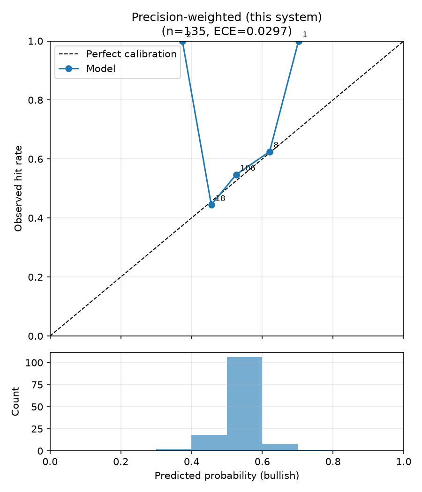
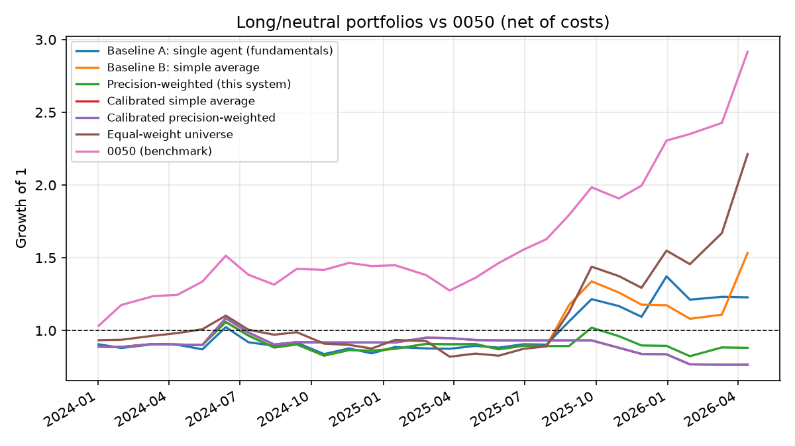

# 真實資料回測結果報告（完整版）

**Precision-Weighted Multi-Agent Investment Research System — FinMind 實資料驗證**

| | |
|---|---|
| 執行日期 | 2026-07-04（2026-10-06 修訂：共用交易日曆、報酬層級評估、含息 outcome、有方向訊號信心下限 0.5） |
| 資料來源 | FinMind（月營收、季度財報、日價量、歷史新聞） |
| 股票 | 國巨 2327、華新科 2492、禾伸堂 3026、凱美 2375、大毅 2478（被動元件 5 檔） |
| 期間 | 2024-01-02 ~ 2026-04-22（預測時點），horizon 20 個交易日 |
| 取樣 | 每 21 個交易日一個預測點，共 **135 個預測事件** |
| 應驗判定 | horizon 期末含息總報酬 > 0 → outcome = 1（2026-10-06 前為未還原收盤價） |
| Agent 模式 | 財報 + 新聞事件 Agent，均為規則式判斷（無 LLM key） |

> **2026-10-07 規格 5.2 修訂**：合併公式與訊號門檻已改為確信度加權
> （見[校準報告第 8 節](calibration_report.md#8-訊號公式修訂2026-10-07)）。
> 本報告中合併策略（簡單平均、精度加權）的機率、訊號與組合報酬為修訂前的數字；
> 單一 Agent 的數字不受影響。最新數字見 `reports/` 與校準報告第 8 節。


> 本報告是[縮小版報告](finmind_scoped_report.md)（3 檔 / 47 事件）的完整版對照組，
> 樣本量擴至 5 檔 / 135 事件、期間回溯至 2024-01。結論與縮小版一致，且更大的
> 樣本量將差距從統計雜訊層級收斂為穩定結果。
>
> **2026-10-06 修訂**：原版各股依自身交易日曆取樣，國巨 2025-08 停牌 7 日後
> 其預測時點落後其他 4 檔 7 天。改為共用市場日曆後，國巨最後 8 個事件換成
> 對齊後的日期（其餘 127 個事件逐筆相同），以下數字已全部更新；結論不變。
> 新增第 4 節報酬層級評估。同日另有兩項修正，數字已全部反映：outcome 改用
> 含息總報酬；有方向的訊號信心下限設為 0.5（見第 3 節末）。

## 1. 總體結果

| 策略 | 平均 Brier ↓ | 方向準確率 ↑ | ECE ↓ | n(方向) |
|---|---|---|---|---|
| Baseline A：單一 Agent（財報） | 0.2593 | 0.478 | 0.1174 | 69 |
| Baseline B：簡單平均合併 | **0.2556** | 0.488 | **0.0610** | 84 |
| 本系統：精度加權合併 | 0.2557 | 0.488 | 0.0672 | 84 |

驗收判定（規格 6.3）：精度加權 Brier **優於單一 Agent ✅**、與簡單平均
**實質持平**（差距 0.0001，遠小於抽樣誤差）❌；ECE 優於單一 Agent、遜於
簡單平均 ❌。三策略 Brier 皆**高於** 0.25 的無資訊基準（永遠猜 0.5），
機率預測本身沒有帶來資訊。

校準曲線：



（其餘兩策略見 `reports/finmind_full/calibration_baseline_*.png`）

## 2. 每檔分解

| 股票 | n | outcome 基率 | 單一 Agent Brier | 精度加權 Brier |
|---|---|---|---|---|
| 國巨 2327 | 27 | 0.59 | 0.251 | 0.254 |
| 華新科 2492 | 27 | 0.41 | 0.255 | 0.256 |
| 禾伸堂 3026 | 27 | 0.63 | 0.258 | **0.254** |
| 凱美 2375 | 27 | 0.56 | 0.263 | **0.255** |
| 大毅 2478 | 27 | 0.56 | 0.269 | **0.259** |

5 檔中有 3 檔（3026 / 2375 / 2478）精度加權合併優於單一財報 Agent，其餘 2 檔
（2327 / 2492）因財報 Agent 本身在該檔已相當可靠，合併未再帶來改善。

## 3. 核心發現：精度加權為何 ≈ 簡單平均

回測結束時的精度記錄（每個 Agent×股票 n=26）：

| Agent | 股票 | n | Brier EMA | precision |
|---|---|---|---|---|
| fundamentals_agent | 2327 | 26 | 0.251 | 3.83 |
| news_agent | 2327 | 26 | 0.252 | 3.81 |
| fundamentals_agent | 2492 | 26 | 0.246 | 3.91 |
| news_agent | 2492 | 26 | 0.307 | 3.15 |
| fundamentals_agent | 3026 | 26 | 0.272 | 3.55 |
| news_agent | 3026 | 26 | 0.258 | 3.73 |
| fundamentals_agent | 2375 | 26 | 0.299 | 3.24 |
| news_agent | 2375 | 26 | 0.277 | 3.49 |
| fundamentals_agent | 2478 | 26 | 0.252 | 3.82 |
| news_agent | 2478 | 26 | 0.220 | 4.35 |

兩個 Agent 的實際可靠度落在 0.22–0.31 的窄帶，同檔精度比僅 **1.00–1.24**，導致全部 135 個事件中，精度加權與簡單平均的合併
機率**分歧平均僅 0.0009、最大 0.0075，無一事件超過 0.01**。

這不是機制失效，而是理論預期的行為：預測處理框架中，當來源可靠度無法
區分時，等權（loose coupling）本身就是精度加權的均衡解。對照 synthetic
實驗（來源可靠度刻意分化時，精度加權在 17/20 seeds 優於簡單平均，見
[technical_note.md](technical_note.md) 第 3 節），可確認：**精度加權的
價值條件是來源可靠度的實質分化**，本期間兩個規則式 Agent 恰好同樣可靠
（也同樣平庸）。相較縮小版 47 個事件，樣本擴至 135 後此結論更為穩固。

其他觀察：

- **合併一致優於單一 Agent**（Brier 0.2556–0.2557 vs 0.2593；ECE
  0.061–0.067 vs 0.117）：即使精度未分化，ensemble 分散效果仍成立
- **冷啟動 vs 成熟期**：前 5 個時點（冷啟動，n=25）三策略 Brier
  0.290–0.302；成熟期（n=110）0.248–0.250。冷啟動期較差反映各檔前期
  樣本少、預設均等權重，與機制無關
- 方向準確率 0.488（基率 0.548）：規則式 Agent 訊號偏弱，這是量化上
  最需要改進的環節
- **有方向訊號的信心下限（2026-10-06 修正）**：規格 6.1 以 p = confidence
  換算 bullish 的機率，規則式評分遇到內部矛盾會扣信心，曾產生「bullish 但
  p < 0.5」的訊號（財報 Agent 69 個有方向訊號中 9 個）。這讓 Brier 把它們當
  反方向計分，合併時卻照原方向計入。修正為有方向的訊號信心下限 0.5
  （`agents/base.py`，原始值保留於 `raw_features.confidence_raw`）。這些訊號
  的方向命中率僅 33%，舊換算等於歪打正著，修正後 Brier 略升
  （0.2584 → 0.2593），計分才是誠實的

## 4. 報酬層級評估（2026-10-06 新增）

Brier / ECE 只衡量機率品質。這一節回答「照訊號操作能不能賺錢、有沒有贏 0050」。

**設定**：每個預測時點為一期（持有 20 個交易日），等權持有訊號為 bullish
的股票，其餘持現金（long/neutral，不放空）；單邊交易成本 0.296%（手續費
0.1425%×2 + 證交稅 0.3%，均攤買賣兩邊）。報酬一律用**含息還原總報酬**，
由 FinMind `TaiwanStockDividendResult` + `TaiwanStockSplitPrice` 自行還原
（還原股價資料集需付費等級）。共 27 期。

| 策略 | 累積報酬 | 年化報酬 | 年化波動 | Sharpe | 最大回撤 | 每期超額 t / p |
|---|---|---|---|---|---|---|
| Baseline A：單一 Agent（財報） | +22.8% | +9.6% | 30.5% | 0.31 | −18.1% | −2.13 / 0.03 |
| Baseline B：簡單平均合併 | +86.5% | +31.9% | 37.3% | 0.86 | −19.1% | −1.03 / 0.30 |
| 本系統：精度加權合併 | +86.5% | +31.9% | 37.3% | 0.86 | −19.1% | −1.03 / 0.30 |
| 對照：等權持有全部 5 檔 | +121.3% | +42.3% | 39.7% | 1.07 | −25.6% | −0.47 / 0.64 |
| **基準：0050** | **+191.7%** | **+60.9%** | 24.6% | **2.48** | −15.8% | — |

連續報酬 Rank IC（看多機率 vs 20 日含息報酬）：

| 策略 | Pooled IC (p) | 橫斷面 IC 平均 (t, p) |
|---|---|---|
| 單一 Agent | −0.080 (0.35) | −0.149 (−1.32, 0.19) |
| 簡單平均 | −0.071 (0.41) | −0.170 (−1.54, 0.12) |
| 精度加權 | −0.074 (0.39) | −0.174 (−1.56, 0.12) |



解讀：

1. **所有策略都輸 0050**，也輸給「無腦等權持有 5 檔」。合併策略空手的
   3 期中有 1 期（2025-03）避開了等權組合 −11.6% 的下跌，擇時本身是小幅
   正貢獻；落後等權持有的主因是**持股期間選錯股**——與下方負的橫斷面
   IC 一致。
2. **單一財報 Agent 顯著輸 0050**（每期超額 t = −2.13）；合併策略的落後
   不顯著，但方向一致為負。
3. **橫斷面 IC 為負（約 −0.15 到 −0.17）**：同一時點 5 檔之間，看多機率
   越高的股票後續報酬反而略低。t ≈ −1.3 到 −1.6，未達顯著，但至少可確定
   **規則式 Agent 沒有選股能力**。
4. 精度加權與簡單平均的訊號在 135 個事件中**完全相同**，兩者組合報酬
   一致，與第 3 節「精度未分化 → 收斂至等權」的結論吻合。
5. 0050 在此期間（AI 行情帶動權值股）年化 +61%、Sharpe 2.48，是極難
   超越的基準；被動元件族群本身就落後大盤，這部分與 Agent 無關。

資料品質附帶發現：國巨 2025-08 停牌期間進行股票分割（546 → 136.5），
未還原價在 2025-07-29 那期顯示 −74%，含息還原後實為 +3.6%。原本以未還原價
判定時此事件 outcome 誤標為 0。使用者決策（2026-10-06）：outcome 改用含息
總報酬（config `backtest.outcome_basis: total_return`），此事件改為 1。該事件
三策略機率皆為 0.5，故 Brier 不變，僅 ECE 變動（上表已更新）。

## 5. 限制

1. **樣本量**：135 個事件雖為縮小版的近 3 倍，每檔仍僅 27 筆，統計檢定力
   不足以對 0.0001 級別的 Brier 差距下結論——但足以確立「精度加權在來源
   同質時無增益」為穩定結果而非雜訊
2. **無 LLM 判讀**：兩個 Agent 皆為規則式 fallback；法說會敘述、新聞
   語意等 LLM 擅長的訊號完全未使用
3. **新聞資料**：FinMind 免費層新聞僅有標題（無內文），來源可信度分級
   （公告>媒體>論壇）的分化作用有限
4. **期間與族群單一**：2024–2026 且全數為被動元件，未涵蓋完整多空循環
   與跨產業異質性

## 6. 下一步

1. 接上 `ANTHROPIC_API_KEY` 讓兩個 Agent 用 LLM 判讀，重跑同一期間比較
   規則式 vs LLM 的可靠度分化程度——這是最可能讓精度比拉開的槓桿
2. Phase 2：供應鏈 / 總經 Agent 加入後，來源異質性提高，精度加權的
   理論優勢更有機會顯現
3. 合併機制升級：對數意見池 / Agent 層級重新校準（見技術筆記第 6 節）

---

*重現方式：*

```bash
.venv/bin/python backtest/run_backtest.py --mode finmind \
  --start-date 2024-01-01 --end-date 2026-05-31 --step-days 21 \
  --agents fundamentals_agent,news_agent \
  --output-dir reports/finmind_full
```

*（`data_cache/` 已含全部所需 FinMind 回應，重跑不消耗 API 額度）*
