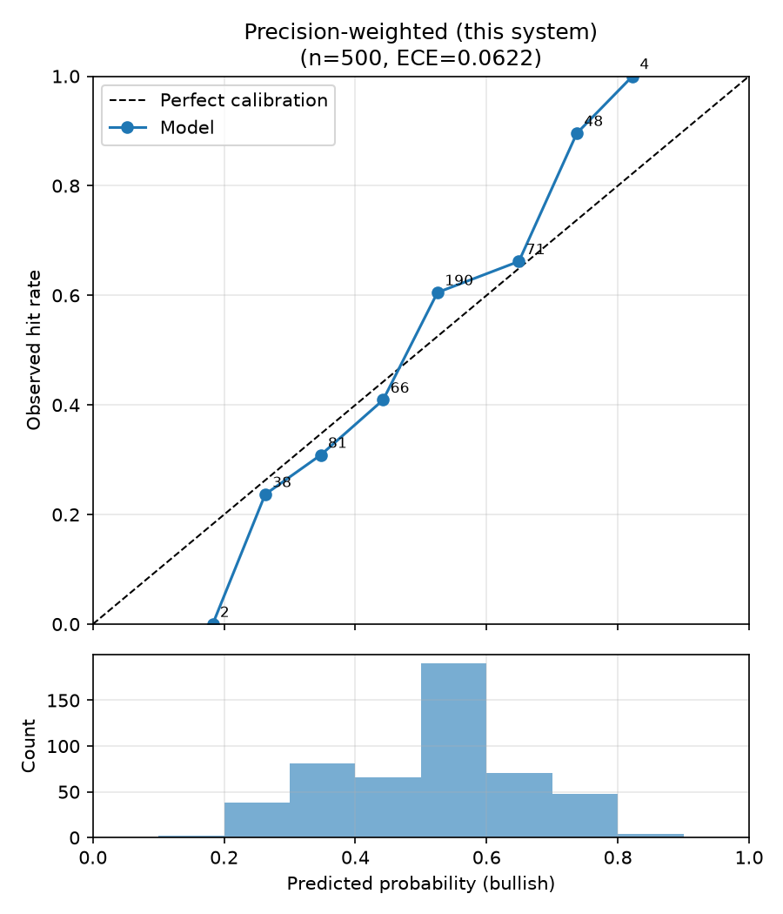

# 回測比較報表：三種合併策略（規格 6.3）

- 執行模式：`synthetic`
- 預測事件數：500（5 檔股票）
- 期間：2023-01-02 ~ 2024-11-25
- 應驗判定：horizon 期末絕對報酬 > 0（20 個交易日）

| 策略 | 平均 Brier ↓ | 方向準確率 ↑ | ECE ↓ | n(方向) |
|---|---|---|---|---|
| Baseline A：單一 Agent（財報） | 0.2233 | 0.688 | 0.0520 | 292 |
| Baseline B：簡單平均合併 | 0.2168 | 0.714 | 0.0625 | 311 |
| 本系統：精度加權合併 | 0.2164 | 0.707 | 0.0622 | 324 |

## 驗收標準（規格 6.3）

- 精度加權 Brier 優於兩個 baseline：✅ 通過
- 精度加權 ECE 不劣於兩個 baseline：❌ 未通過

## 校準曲線

## 備註

- Baseline A 的機率採規格 6.1 轉換；合併策略的機率為各 Agent 6.1 機率的
  加權線性意見池（權重同規格 5.2 合併公式）。
- 精度加權在回測初期（冷啟動，n<5）等同簡單平均，差異隨精度記錄累積浮現。