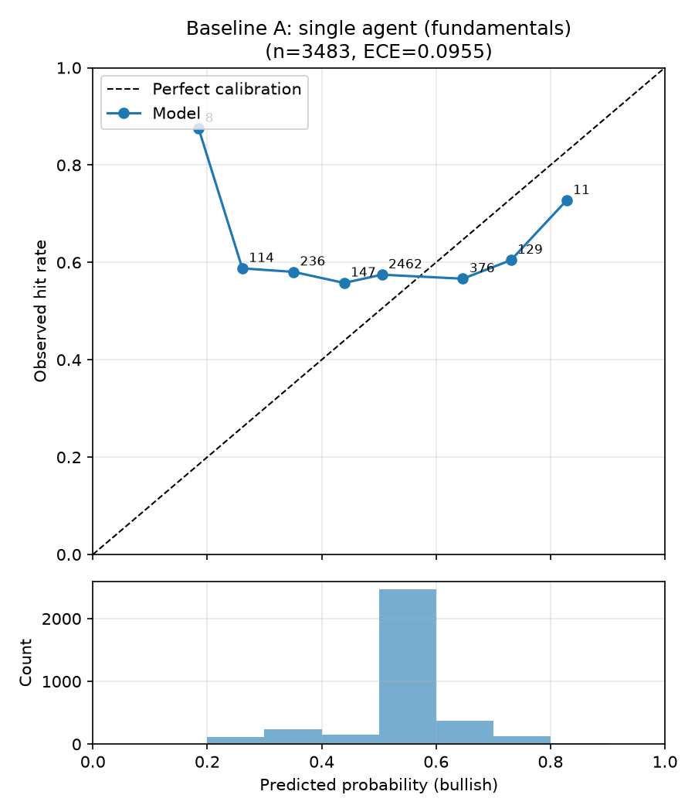
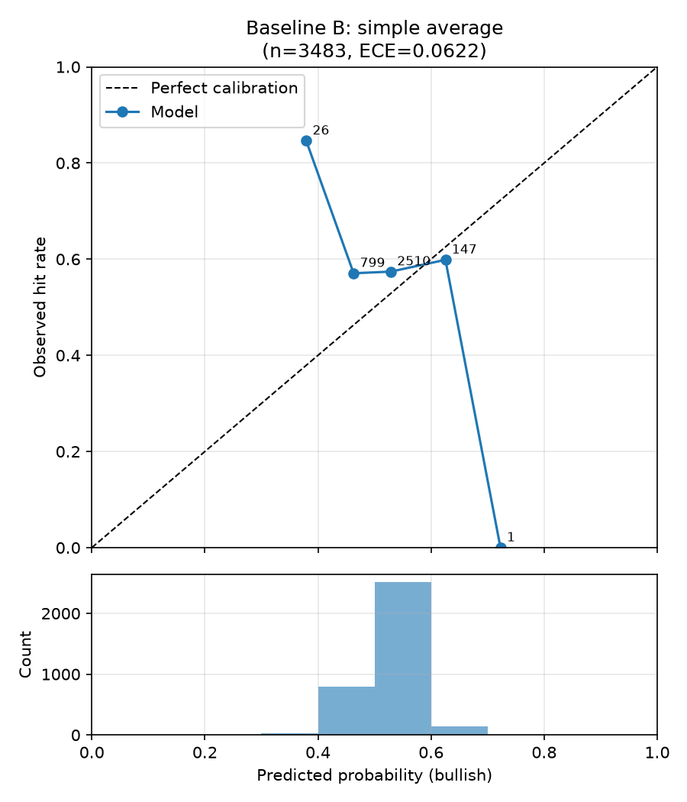
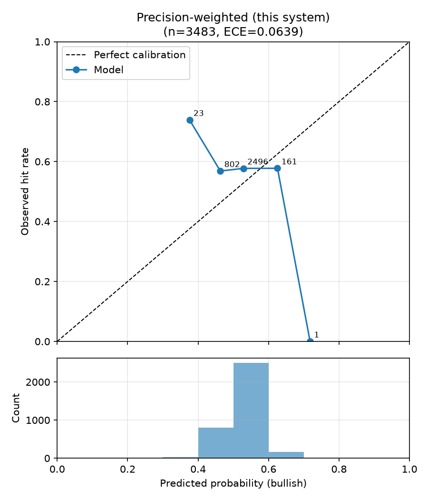
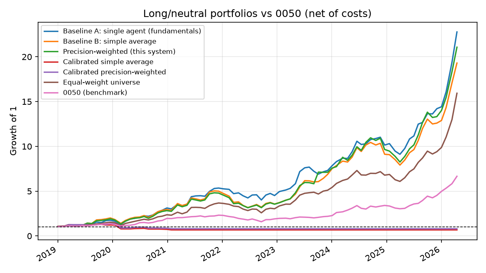

# 回測比較報表：合併策略比較（規格 6.3 + Agent 層級重新校準）

- 執行模式：`finmind`
- 預測事件數：3483（41 檔股票）
- Agent：fundamentals_agent, macro_agent, supply_chain_agent
- 期間：2019-01-02 ~ 2026-04-15
- LLM 判讀：未使用（規則式）
- 應驗判定：horizon 期末絕對報酬 > 0（20 個交易日，含息總報酬）

| 策略 | 平均 Brier ↓ | 方向準確率 ↑ | ECE ↓ | n(方向) |
|---|---|---|---|---|
| Baseline A：單一 Agent（財報） | 0.2574 | 0.513 | 0.0955 | 1849 |
| Baseline B：簡單平均合併 | 0.2501 | 0.532 | 0.0622 | 1011 |
| 本系統：精度加權合併 | 0.2500 | 0.534 | 0.0639 | 1020 |
| 校準後簡單平均 | 0.2499 | 0.400 | 0.0703 | 70 |
| 校準後精度加權 | 0.2498 | 0.458 | 0.0701 | 72 |

### 個別 Agent（消融）

| Agent | 平均 Brier ↓ | ECE ↓ | 校準後 Brier ↓ | 校準後 ECE ↓ | 期末收縮係數 a | p ≠ 0.5 比例 | LLM 判讀比例 |
|---|---|---|---|---|---|---|---|
| fundamentals_agent | 0.2574 | 0.0955 | 0.2508 | 0.0766 | 0.10 | 35% | 0% |
| macro_agent | 0.2550 | 0.0941 | 0.2506 | 0.0776 | 0.00 | 19% | 0% |
| supply_chain_agent | 0.2514 | 0.0647 | 0.2497 | 0.0654 | 0.39 | 59% | 0% |

## 驗收標準（規格 6.3）

- 精度加權 Brier 優於兩個 baseline：✅ 通過
- 精度加權 ECE 不劣於兩個 baseline：❌ 未通過
- 校準後精度加權 Brier 優於校準後簡單平均：✅ 通過

## 校準曲線

## 備註

- Baseline A 的機率採規格 6.1 轉換；合併策略的機率為各 Agent 6.1 機率的
  加權線性意見池（權重同規格 5.2 合併公式）。
- 精度加權在回測初期（冷啟動，n<5）等同簡單平均，差異隨精度記錄累積浮現。

## 報酬層級評估（long/neutral 組合 vs 0050）

- 組合：每期等權持有 bullish 標的，其餘持現金；單邊交易成本 0.296%
- 報酬皆為含息還原總報酬（除權息、配股、分割已還原）
- 期間 0050 累積報酬：+566.1%

| 策略 | 累積報酬 | 年化報酬 | 年化波動 | Sharpe | 最大回撤 | 與 0050 累積報酬差 | 每期超額 t / p | 持股期比例 |
|---|---|---|---|---|---|---|---|---|
| Baseline A：單一 Agent（財報） | +2177.4% | +55.5% | 28.9% | 1.92 | -25.6% | +1611.3% | 2.24 / 0.03 | 100% |
| Baseline B：簡單平均合併 | +1830.1% | +51.9% | 32.3% | 1.61 | -36.9% | +1264.0% | 1.78 / 0.07 | 98% |
| 本系統：精度加權合併 | +2007.3% | +53.8% | 32.5% | 1.65 | -34.7% | +1441.1% | 1.91 / 0.06 | 96% |
| 校準後簡單平均 | -32.4% | -5.4% | 15.8% | -0.34 | -47.9% | -598.6% | -4.13 / 0.00 | 15% |
| 校準後精度加權 | -19.8% | -3.1% | 16.5% | -0.19 | -41.9% | -585.9% | -3.74 / 0.00 | 15% |
| 對照：等權持有全部股票池 | +1493.2% | +47.8% | 25.7% | 1.86 | -29.8% | +927.1% | 2.17 / 0.03 | 100% |
| 基準：0050 | +566.1% | +30.7% | 20.6% | 1.49 | -31.6% | +0.0% | — | 100% |

### 連續報酬 Rank IC（看多機率 vs 20 日含息報酬）

| 策略 | Pooled IC | p | 橫斷面 IC 平均 | t | p | 期數 |
|---|---|---|---|---|---|---|
| Baseline A：單一 Agent（財報） | +0.028 | 0.10 | +0.026 | 1.41 | 0.16 | 85 |
| Baseline B：簡單平均合併 | +0.038 | 0.02 | +0.032 | 1.54 | 0.12 | 85 |
| 本系統：精度加權合併 | +0.041 | 0.01 | +0.036 | 1.70 | 0.09 | 85 |
| 校準後簡單平均 | +0.009 | 0.58 | +0.034 | 1.42 | 0.16 | 85 |
| 校準後精度加權 | +0.011 | 0.52 | +0.036 | 1.52 | 0.13 | 85 |

- Pooled IC 混合了跨期的市場漲跌；橫斷面 IC 只看同一時點 5 檔之間的排序，
  是選股能力的直接衡量（同時點機率全相同的期數不計入）。
- p 值以常態近似計算，期數少時偏樂觀，僅供參考。
- 夏普比率未扣無風險利率；每期為 20 個交易日持有、每 step 日再平衡。
- 未還原價與含息總報酬方向不一致的事件：47 / 3483
  （outcome 依 config `backtest.outcome_basis` 判定，見 config/tickers.yaml）。