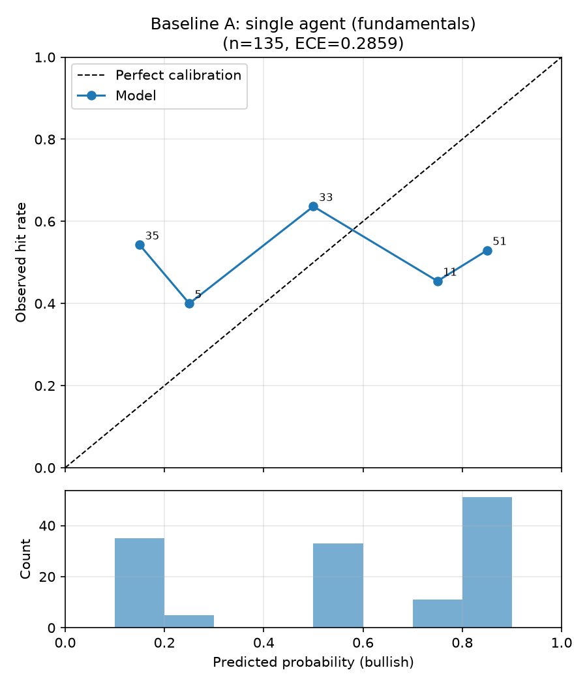
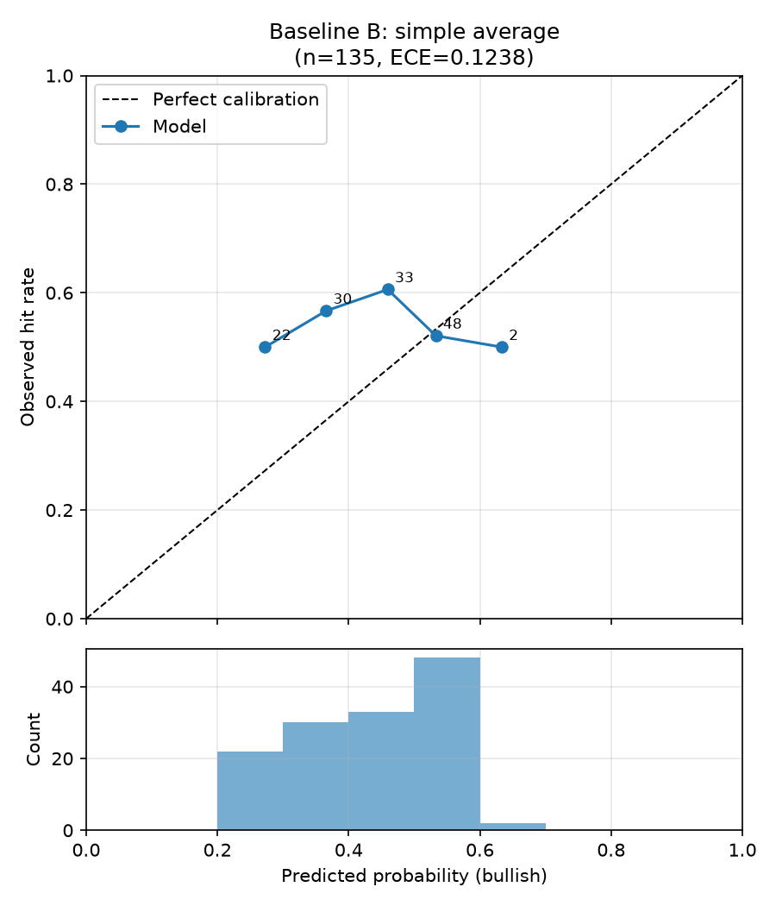
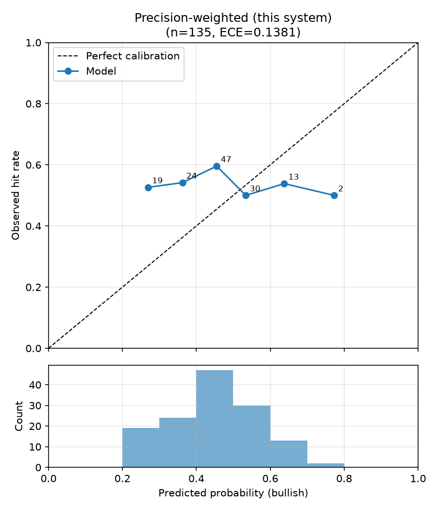
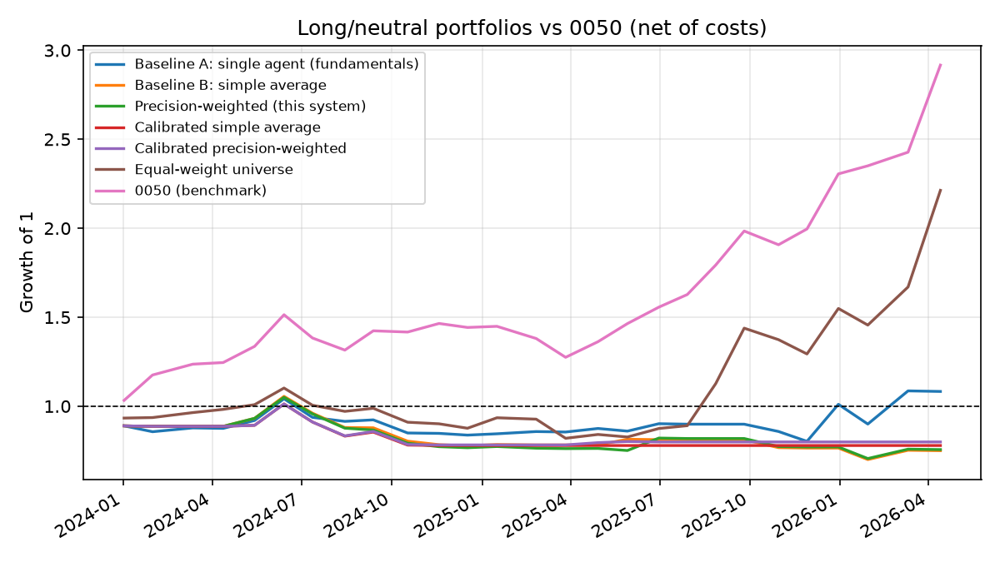

# 回測比較報表：合併策略比較（規格 6.3 + Agent 層級重新校準）

- 執行模式：`finmind`
- 預測事件數：135（5 檔股票）
- Agent：fundamentals_agent, news_agent, macro_agent
- 期間：2024-01-02 ~ 2026-04-13
- LLM 判讀：ollama / `qwen3:8b`（新呼叫 0、快取命中 386、失敗退回規則式 0）
- 應驗判定：horizon 期末絕對報酬 > 0（20 個交易日，含息總報酬）

| 策略 | 平均 Brier ↓ | 方向準確率 ↑ | ECE ↓ | n(方向) |
|---|---|---|---|---|
| Baseline A：單一 Agent（財報） | 0.3354 | 0.500 | 0.2859 | 102 |
| Baseline B：簡單平均合併 | 0.2726 | 0.449 | 0.1238 | 78 |
| 本系統：精度加權合併 | 0.2733 | 0.420 | 0.1381 | 88 |
| 校準後簡單平均 | 0.2547 | 0.472 | 0.0881 | 36 |
| 校準後精度加權 | 0.2544 | 0.500 | 0.0700 | 38 |

### 個別 Agent（消融）

| Agent | 平均 Brier ↓ | ECE ↓ | 校準後 Brier ↓ | 校準後 ECE ↓ | 期末收縮係數 a | p ≠ 0.5 比例 | LLM 判讀比例 |
|---|---|---|---|---|---|---|---|
| fundamentals_agent | 0.3354 | 0.2859 | 0.2644 | 0.0706 | 0.09 | 76% | 100% |
| news_agent | 0.2718 | 0.1289 | 0.2600 | 0.0705 | 0.18 | 50% | 86% |
| macro_agent | 0.4047 | 0.3944 | 0.2664 | 0.1226 | 0.00 | 100% | 100% |

## 驗收標準（規格 6.3）

- 精度加權 Brier 優於兩個 baseline：❌ 未通過
- 精度加權 ECE 不劣於兩個 baseline：❌ 未通過
- 校準後精度加權 Brier 優於校準後簡單平均：✅ 通過

## 校準曲線

## 備註

- Baseline A 的機率採規格 6.1 轉換；合併策略的機率為各 Agent 6.1 機率的
  加權線性意見池（權重同規格 5.2 合併公式）。
- 精度加權在回測初期（冷啟動，n<5）等同簡單平均，差異隨精度記錄累積浮現。

## 報酬層級評估（long/neutral 組合 vs 0050）

- 組合：每期等權持有 bullish 標的，其餘持現金；單邊交易成本 0.296%
- 報酬皆為含息還原總報酬（除權息、配股、分割已還原）
- 期間 0050 累積報酬：+191.7%

| 策略 | 累積報酬 | 年化報酬 | 年化波動 | Sharpe | 最大回撤 | 與 0050 累積報酬差 | 每期超額 t / p | 持股期比例 |
|---|---|---|---|---|---|---|---|---|
| Baseline A：單一 Agent（財報） | +8.3% | +3.6% | 29.0% | 0.12 | -23.0% | -183.4% | -2.25 / 0.02 | 78% |
| Baseline B：簡單平均合併 | -25.0% | -12.0% | 18.0% | -0.66 | -33.6% | -216.7% | -4.12 / 0.00 | 52% |
| 本系統：精度加權合併 | -24.4% | -11.7% | 18.8% | -0.62 | -32.8% | -216.1% | -3.99 / 0.00 | 63% |
| 校準後簡單平均 | -22.1% | -10.5% | 15.8% | -0.66 | -23.1% | -213.8% | -4.14 / 0.00 | 26% |
| 校準後精度加權 | -20.1% | -9.5% | 15.9% | -0.60 | -22.7% | -211.8% | -4.07 / 0.00 | 33% |
| 對照：等權持有全部股票池 | +121.3% | +42.3% | 39.7% | 1.07 | -25.6% | -70.4% | -0.47 / 0.64 | 100% |
| 基準：0050 | +191.7% | +60.9% | 24.6% | 2.48 | -15.8% | +0.0% | — | 100% |

### 連續報酬 Rank IC（看多機率 vs 20 日含息報酬）

| 策略 | Pooled IC | p | 橫斷面 IC 平均 | t | p | 期數 |
|---|---|---|---|---|---|---|
| Baseline A：單一 Agent（財報） | -0.111 | 0.20 | -0.061 | -0.55 | 0.58 | 24 |
| Baseline B：簡單平均合併 | -0.097 | 0.26 | +0.039 | 0.40 | 0.69 | 26 |
| 本系統：精度加權合併 | -0.080 | 0.36 | +0.032 | 0.36 | 0.72 | 27 |
| 校準後簡單平均 | -0.139 | 0.11 | -0.004 | -0.05 | 0.96 | 26 |
| 校準後精度加權 | -0.121 | 0.16 | -0.061 | -0.71 | 0.47 | 27 |

- Pooled IC 混合了跨期的市場漲跌；橫斷面 IC 只看同一時點 5 檔之間的排序，
  是選股能力的直接衡量（同時點機率全相同的期數不計入）。
- p 值以常態近似計算，期數少時偏樂觀，僅供參考。
- 夏普比率未扣無風險利率；每期為 20 個交易日持有、每 step 日再平衡。
- 未還原價與含息總報酬方向不一致的事件：1 / 135
  （outcome 依 config `backtest.outcome_basis` 判定，見 config/tickers.yaml）。