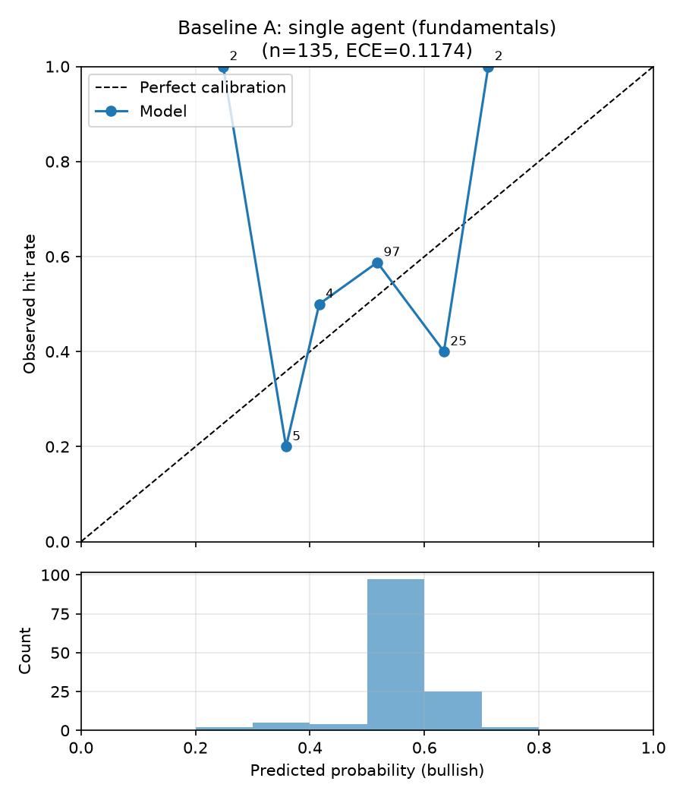
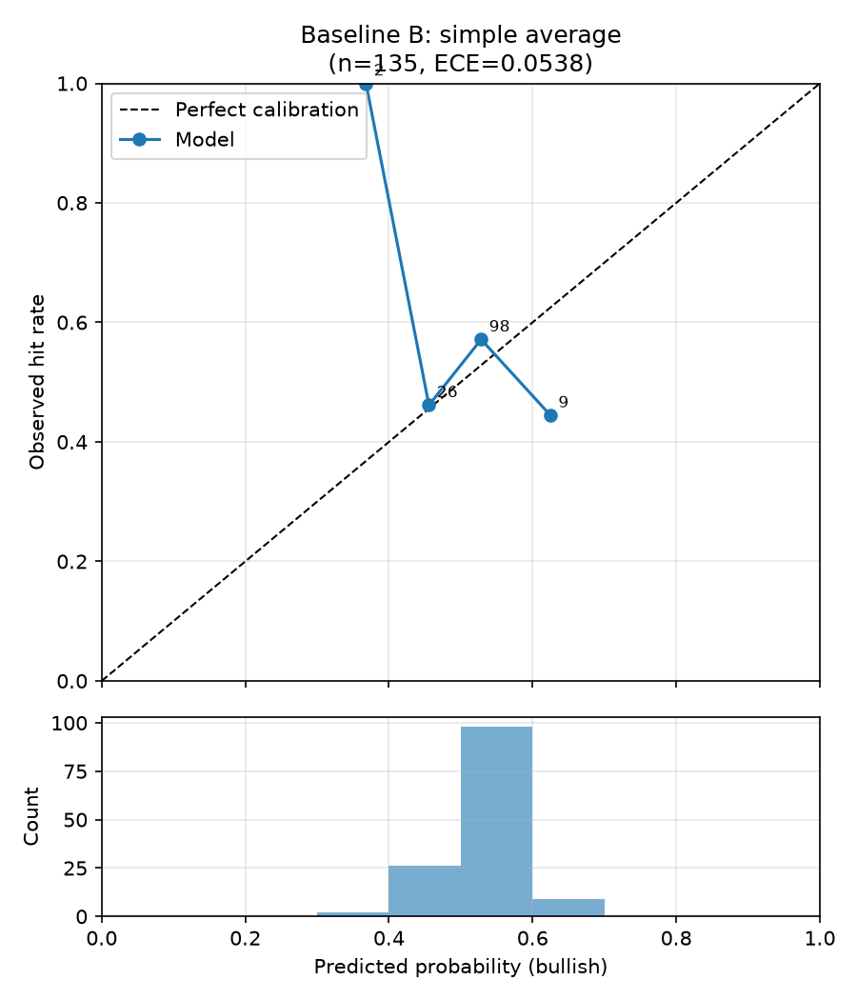
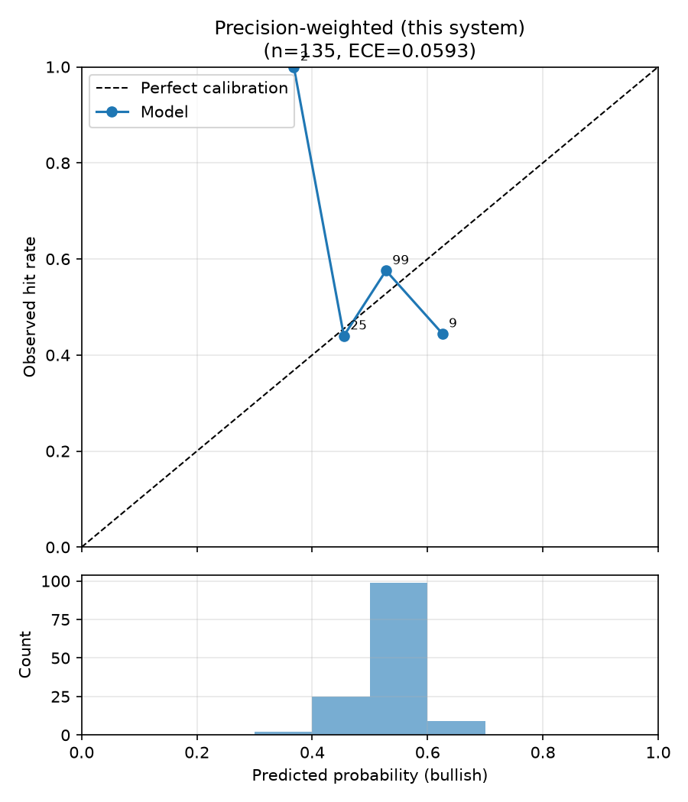
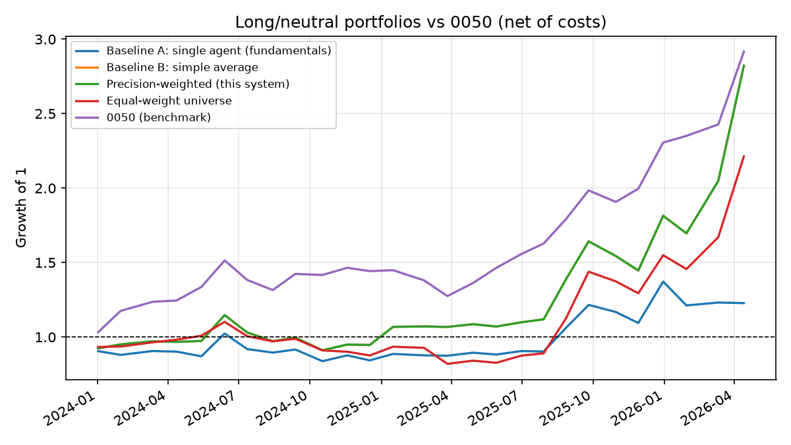

# 回測比較報表：三種合併策略（規格 6.3）

- 執行模式：`finmind`
- 預測事件數：135（5 檔股票）
- Agent：fundamentals_agent, news_agent, macro_agent
- 期間：2024-01-02 ~ 2026-04-13
- 應驗判定：horizon 期末絕對報酬 > 0（20 個交易日，含息總報酬）

| 策略 | 平均 Brier ↓ | 方向準確率 ↑ | ECE ↓ | n(方向) |
|---|---|---|---|---|
| Baseline A：單一 Agent（財報） | 0.2593 | 0.478 | 0.1174 | 69 |
| Baseline B：簡單平均合併 | 0.2538 | 0.494 | 0.0538 | 87 |
| 本系統：精度加權合併 | 0.2540 | 0.494 | 0.0593 | 87 |

### 個別 Agent（消融）

| Agent | 平均 Brier ↓ | ECE ↓ | p ≠ 0.5 比例 |
|---|---|---|---|
| fundamentals_agent | 0.2593 | 0.1174 | 44% |
| news_agent | 0.2531 | 0.0883 | 28% |
| macro_agent | 0.2547 | 0.0952 | 21% |

## 驗收標準（規格 6.3）

- 精度加權 Brier 優於兩個 baseline：❌ 未通過
- 精度加權 ECE 不劣於兩個 baseline：❌ 未通過

## 校準曲線

## 備註

- Baseline A 的機率採規格 6.1 轉換；合併策略的機率為各 Agent 6.1 機率的
  加權線性意見池（權重同規格 5.2 合併公式）。
- 精度加權在回測初期（冷啟動，n<5）等同簡單平均，差異隨精度記錄累積浮現。

## 報酬層級評估（long/neutral 組合 vs 0050）

- 組合：每期等權持有 bullish 標的，其餘持現金；單邊交易成本 0.296%
- 報酬皆為含息還原總報酬（除權息、配股、分割已還原）
- 期間 0050 累積報酬：+191.7%

| 策略 | 累積報酬 | 年化報酬 | 年化波動 | Sharpe | 最大回撤 | 與 0050 累積報酬差 | 每期超額 t / p | 持股期比例 |
|---|---|---|---|---|---|---|---|---|
| Baseline A：單一 Agent（財報） | +22.8% | +9.6% | 30.5% | 0.31 | -18.1% | -168.9% | -2.13 / 0.03 | 89% |
| Baseline B：簡單平均合併 | +182.2% | +58.6% | 41.8% | 1.40 | -20.6% | -9.5% | 0.16 / 0.87 | 93% |
| 本系統：精度加權合併 | +182.2% | +58.6% | 41.8% | 1.40 | -20.6% | -9.5% | 0.16 / 0.87 | 93% |
| 對照：等權持有全部股票池 | +121.3% | +42.3% | 39.7% | 1.07 | -25.6% | -70.4% | -0.47 / 0.64 | 100% |
| 基準：0050 | +191.7% | +60.9% | 24.6% | 2.48 | -15.8% | +0.0% | — | 100% |

### 連續報酬 Rank IC（看多機率 vs 20 日含息報酬）

| 策略 | Pooled IC | p | 橫斷面 IC 平均 | t | p | 期數 |
|---|---|---|---|---|---|---|
| Baseline A：單一 Agent（財報） | -0.080 | 0.35 | -0.149 | -1.32 | 0.19 | 25 |
| Baseline B：簡單平均合併 | -0.115 | 0.18 | -0.154 | -1.32 | 0.19 | 27 |
| 本系統：精度加權合併 | -0.120 | 0.16 | -0.147 | -1.26 | 0.21 | 27 |

- Pooled IC 混合了跨期的市場漲跌；橫斷面 IC 只看同一時點 5 檔之間的排序，
  是選股能力的直接衡量（同時點機率全相同的期數不計入）。
- p 值以常態近似計算，期數少時偏樂觀，僅供參考。
- 夏普比率未扣無風險利率；每期為 20 個交易日持有、每 step 日再平衡。
- 未還原價與含息總報酬方向不一致的事件：1 / 135
  （outcome 依 config `backtest.outcome_basis` 判定，見 config/tickers.yaml）。