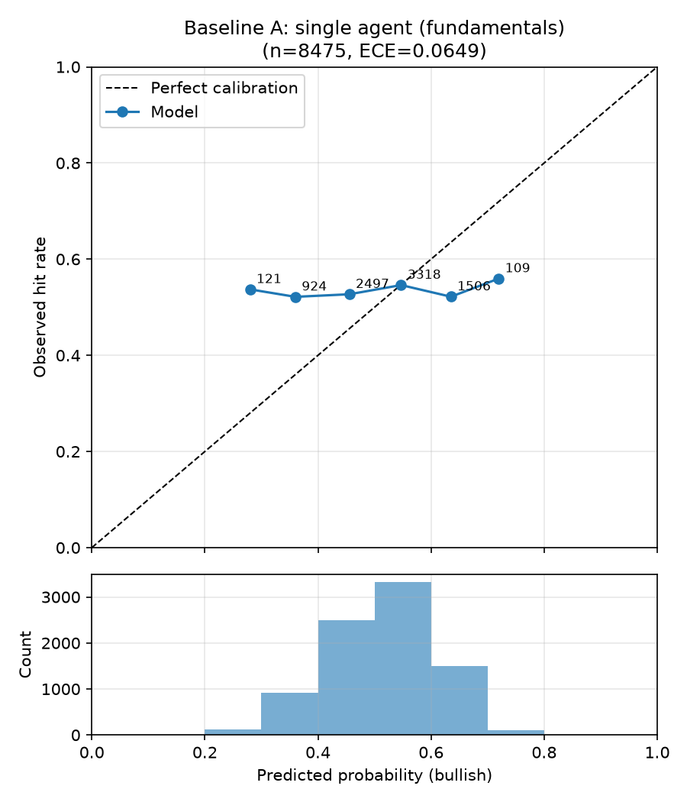
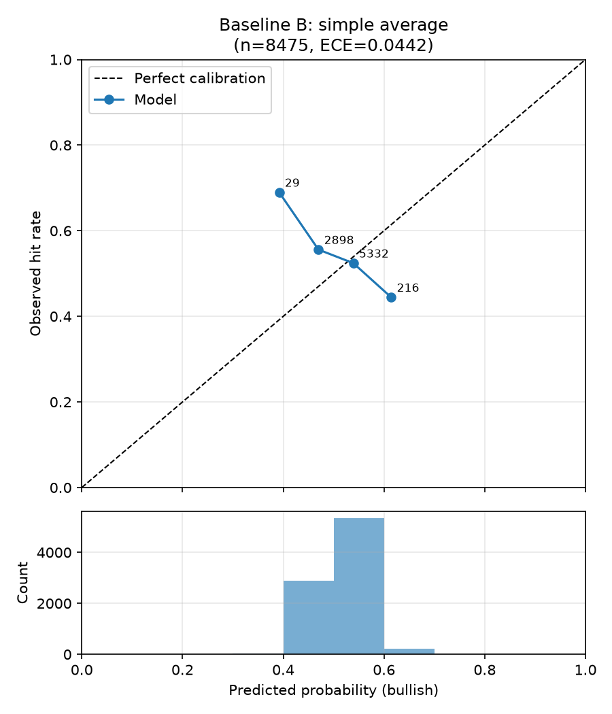
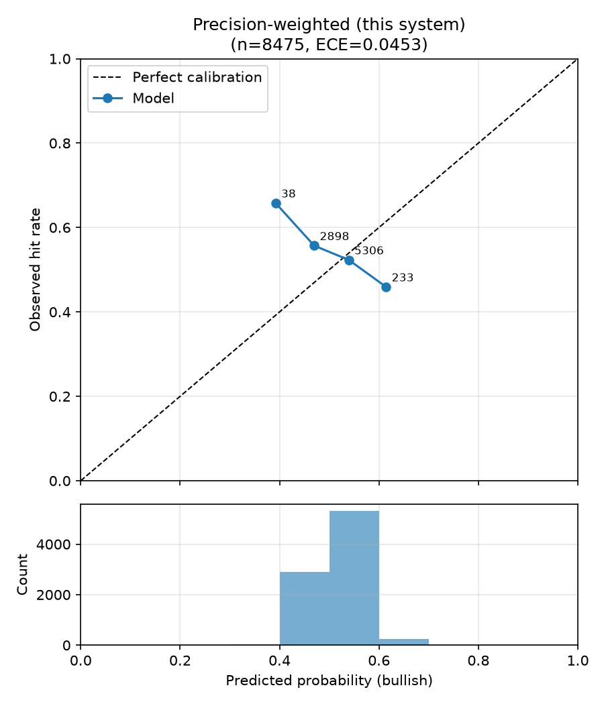
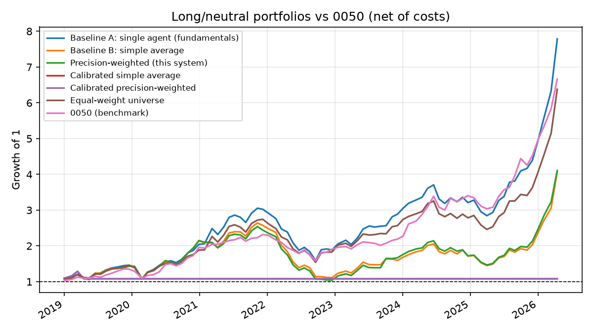

# 回測比較報表：合併策略比較（規格 6.3 + Agent 層級重新校準）

- 執行模式：`finmind`
- 預測事件數：8475（271 檔股票）
- Agent：fundamentals_agent, macro_agent, supply_chain_agent
- 期間：2019-01-02 ~ 2026-04-15
- LLM 判讀：未使用（規則式）
- 規則式輸出：continuous
- 應驗判定：horizon 期末絕對報酬 > 0（20 個交易日，含息總報酬）

| 策略 | 平均 Brier ↓ | 方向準確率 ↑ | ECE ↓ | n(方向) |
|---|---|---|---|---|
| Baseline A：單一 Agent（財報） | 0.2573 | 0.512 | 0.0649 | 8470 |
| Baseline B：簡單平均合併 | 0.2523 | 0.508 | 0.0442 | 2573 |
| 本系統：精度加權合併 | 0.2524 | 0.508 | 0.0453 | 2609 |
| 校準後簡單平均 | 0.2506 | 0.571 | 0.0309 | 42 |
| 校準後精度加權 | 0.2506 | 0.571 | 0.0309 | 42 |

### 個別 Agent（消融）

| Agent | 平均 Brier ↓ | ECE ↓ | 校準後 Brier ↓ | 校準後 ECE ↓ | 期末收縮係數 a | p ≠ 0.5 比例 | LLM 判讀比例 |
|---|---|---|---|---|---|---|---|
| fundamentals_agent | 0.2573 | 0.0649 | 0.2505 | 0.0324 | 0.08 | 100% | 0% |
| macro_agent | 0.2561 | 0.0651 | 0.2506 | 0.0334 | 0.00 | 100% | 0% |
| supply_chain_agent | 0.2563 | 0.0694 | 0.2511 | 0.0307 | 0.00 | 100% | 0% |

## 驗收標準（規格 6.3）

- 精度加權 Brier 優於兩個 baseline：❌ 未通過
- 精度加權 ECE 不劣於兩個 baseline：❌ 未通過
- 校準後精度加權 Brier 優於校準後簡單平均：❌ 未通過

## 校準曲線

## 備註

- Baseline A 的機率採規格 6.1 轉換；合併策略的機率為各 Agent 6.1 機率的
  加權線性意見池（權重同規格 5.2 合併公式）。
- 精度加權在回測初期（冷啟動，n<5）等同簡單平均，差異隨精度記錄累積浮現。

## 報酬層級評估（long/neutral 組合 vs 0050）

- 組合：每期等權持有 bullish 標的，其餘持現金；單邊交易成本 0.296%
- 報酬皆為含息還原總報酬（除權息、配股、分割已還原）
- 期間 0050 累積報酬：+566.1%

| 策略 | 累積報酬 | 年化報酬 | 年化波動 | Sharpe | 最大回撤 | 與 0050 累積報酬差 | 每期超額 t / p | 持股期比例 |
|---|---|---|---|---|---|---|---|---|
| Baseline A：單一 Agent（財報） | +678.5% | +33.6% | 27.2% | 1.24 | -47.9% | +112.4% | 0.60 / 0.55 | 100% |
| Baseline B：簡單平均合併 | +307.2% | +21.9% | 30.4% | 0.72 | -57.9% | -258.9% | -0.60 / 0.55 | 95% |
| 本系統：精度加權合併 | +310.8% | +22.1% | 29.9% | 0.74 | -59.1% | -255.4% | -0.60 / 0.55 | 95% |
| 校準後簡單平均 | +7.9% | +1.1% | 8.4% | 0.13 | -16.2% | -558.2% | -3.45 / 0.00 | 5% |
| 校準後精度加權 | +7.9% | +1.1% | 8.4% | 0.13 | -16.2% | -558.2% | -3.45 / 0.00 | 5% |
| 對照：等權持有全部股票池 | +537.9% | +29.9% | 26.2% | 1.14 | -43.8% | -28.2% | 0.11 / 0.91 | 100% |
| 基準：0050 | +566.1% | +30.7% | 20.6% | 1.49 | -31.6% | +0.0% | — | 100% |

### 連續報酬 Rank IC（看多機率 vs 20 日含息報酬）

| 策略 | Pooled IC | p | 橫斷面 IC 平均 | t | p | 期數 |
|---|---|---|---|---|---|---|
| Baseline A：單一 Agent（財報） | +0.026 | 0.02 | +0.033 | 2.34 | 0.02 | 85 |
| Baseline B：簡單平均合併 | -0.004 | 0.75 | +0.014 | 0.95 | 0.34 | 85 |
| 本系統：精度加權合併 | -0.002 | 0.84 | +0.016 | 1.08 | 0.28 | 85 |
| 校準後簡單平均 | -0.038 | 0.00 | +0.028 | 1.78 | 0.08 | 83 |
| 校準後精度加權 | -0.038 | 0.00 | +0.025 | 1.64 | 0.10 | 83 |

- Pooled IC 混合了跨期的市場漲跌；橫斷面 IC 只看同一時點 5 檔之間的排序，
  是選股能力的直接衡量（同時點機率全相同的期數不計入）。
- p 值以常態近似計算，期數少時偏樂觀，僅供參考。
- 夏普比率未扣無風險利率；每期為 20 個交易日持有、每 step 日再平衡。
- 未還原價與含息總報酬方向不一致的事件：86 / 8475
  （outcome 依 config `backtest.outcome_basis` 判定，見 config/tickers.yaml）。