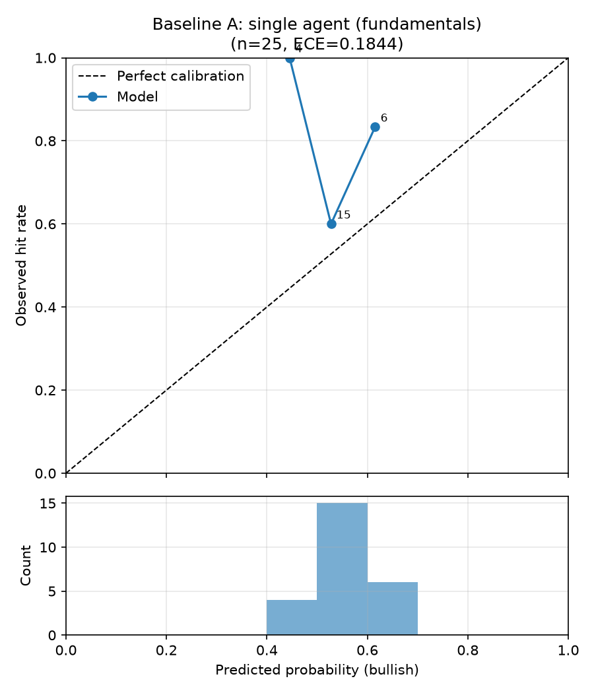
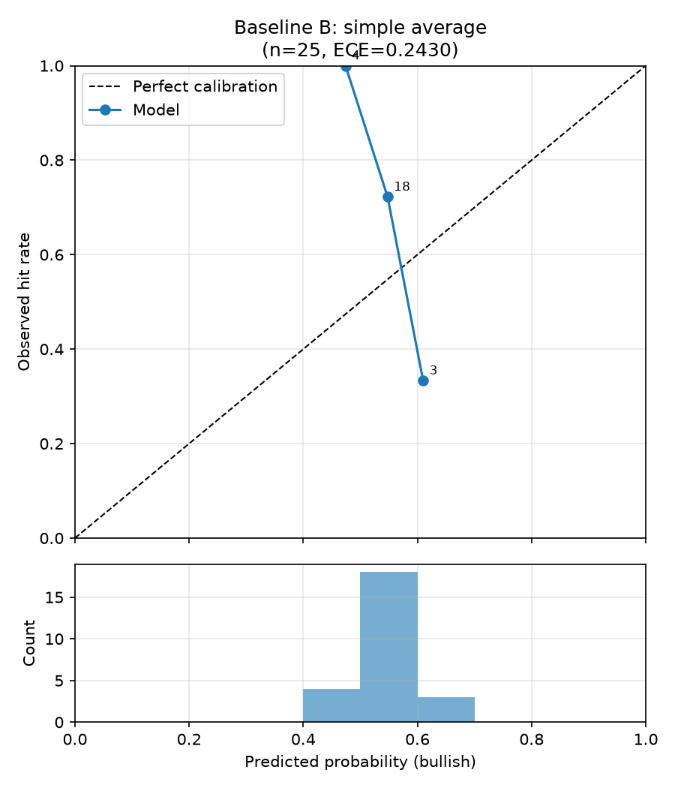
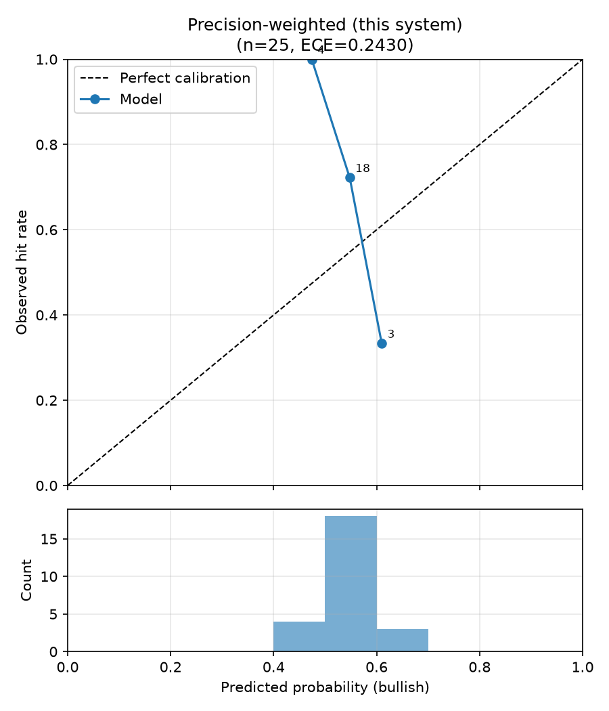

# 回測比較報表：三種合併策略（規格 6.3）

- 執行模式：`finmind`
- 預測事件數：25（5 檔股票）
- 期間：2026-02-23 ~ 2026-04-23
- 應驗判定：horizon 期末絕對報酬 > 0（20 個交易日）

| 策略 | 平均 Brier ↓ | 方向準確率 ↑ | ECE ↓ | n(方向) |
|---|---|---|---|---|
| Baseline A：單一 Agent（財報） | 0.2433 | 0.733 | 0.1844 | 15 |
| Baseline B：簡單平均合併 | 0.2427 | 0.700 | 0.2430 | 20 |
| 本系統：精度加權合併 | 0.2427 | 0.700 | 0.2430 | 20 |

## 驗收標準（規格 6.3）

- 精度加權 Brier 優於兩個 baseline：❌ 未通過
- 精度加權 ECE 不劣於兩個 baseline：❌ 未通過

## 校準曲線

## 備註

- Baseline A 的機率採規格 6.1 轉換；合併策略的機率為各 Agent 6.1 機率的
  加權線性意見池（權重同規格 5.2 合併公式）。
- 精度加權在回測初期（冷啟動，n<5）等同簡單平均，差異隨精度記錄累積浮現。