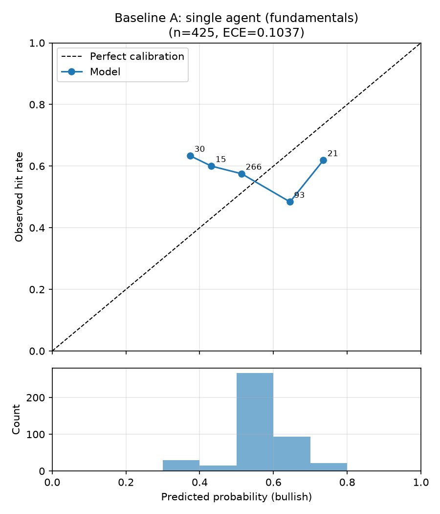
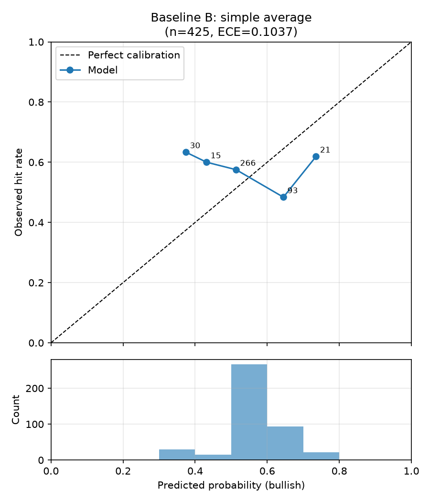
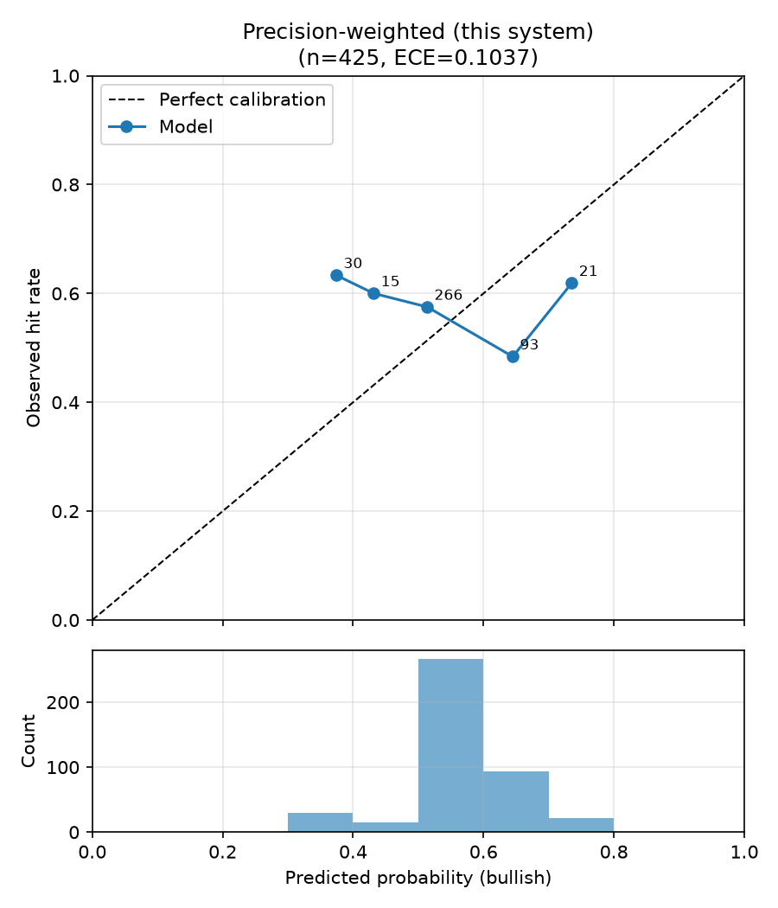
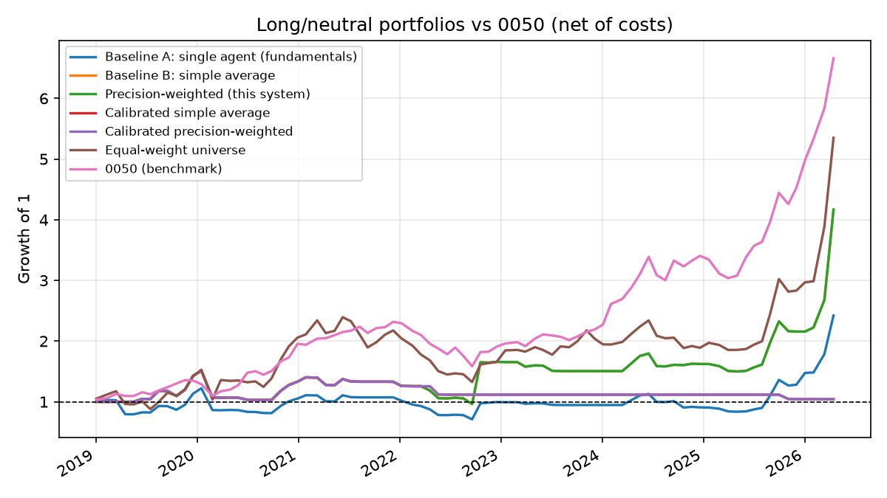

# 回測比較報表：合併策略比較（規格 6.3 + Agent 層級重新校準）

- 執行模式：`finmind`
- 預測事件數：425（5 檔股票）
- Agent：supply_chain_agent
- 期間：2019-01-02 ~ 2026-04-15
- LLM 判讀：未使用（規則式）
- 應驗判定：horizon 期末絕對報酬 > 0（20 個交易日，含息總報酬）

| 策略 | 平均 Brier ↓ | 方向準確率 ↑ | ECE ↓ | n(方向) |
|---|---|---|---|---|
| Baseline A：單一 Agent（財報） | 0.2592 | 0.500 | 0.1037 | 238 |
| Baseline B：簡單平均合併 | 0.2592 | 0.523 | 0.1037 | 195 |
| 本系統：精度加權合併 | 0.2592 | 0.523 | 0.1037 | 195 |
| 校準後簡單平均 | 0.2540 | 0.500 | 0.0768 | 100 |
| 校準後精度加權 | 0.2540 | 0.500 | 0.0768 | 100 |

### 個別 Agent（消融）

| Agent | 平均 Brier ↓ | ECE ↓ | 校準後 Brier ↓ | 校準後 ECE ↓ | 期末收縮係數 a | p ≠ 0.5 比例 | LLM 判讀比例 |
|---|---|---|---|---|---|---|---|
| supply_chain_agent | 0.2592 | 0.1037 | 0.2540 | 0.0768 | 0.16 | 50% | 0% |

## 驗收標準（規格 6.3）

- 精度加權 Brier 優於兩個 baseline：❌ 未通過
- 精度加權 ECE 不劣於兩個 baseline：✅ 通過
- 校準後精度加權 Brier 優於校準後簡單平均：❌ 未通過

## 校準曲線

## 備註

- Baseline A 的機率採規格 6.1 轉換；合併策略的機率為各 Agent 6.1 機率的
  加權線性意見池（權重同規格 5.2 合併公式）。
- 精度加權在回測初期（冷啟動，n<5）等同簡單平均，差異隨精度記錄累積浮現。

## 報酬層級評估（long/neutral 組合 vs 0050）

- 組合：每期等權持有 bullish 標的，其餘持現金；單邊交易成本 0.296%
- 報酬皆為含息還原總報酬（除權息、配股、分割已還原）
- 期間 0050 累積報酬：+566.1%

| 策略 | 累積報酬 | 年化報酬 | 年化波動 | Sharpe | 最大回撤 | 與 0050 累積報酬差 | 每期超額 t / p | 持股期比例 |
|---|---|---|---|---|---|---|---|---|
| Baseline A：單一 Agent（財報） | +142.2% | +13.3% | 33.0% | 0.40 | -41.9% | -424.0% | -1.19 / 0.23 | 66% |
| Baseline B：簡單平均合併 | +316.7% | +22.3% | 41.0% | 0.54 | -36.3% | -249.4% | -0.16 / 0.87 | 54% |
| 本系統：精度加權合併 | +316.7% | +22.3% | 41.0% | 0.54 | -36.3% | -249.4% | -0.16 / 0.87 | 54% |
| 校準後簡單平均 | +4.2% | +0.6% | 18.0% | 0.03 | -31.9% | -561.9% | -3.08 / 0.00 | 24% |
| 校準後精度加權 | +4.2% | +0.6% | 18.0% | 0.03 | -31.9% | -561.9% | -3.08 / 0.00 | 24% |
| 對照：等權持有全部股票池 | +435.1% | +26.7% | 36.9% | 0.72 | -44.7% | -131.1% | 0.11 / 0.91 | 100% |
| 基準：0050 | +566.1% | +30.7% | 20.6% | 1.49 | -31.6% | +0.0% | — | 100% |

### 連續報酬 Rank IC（看多機率 vs 20 日含息報酬）

| 策略 | Pooled IC | p | 橫斷面 IC 平均 | t | p | 期數 |
|---|---|---|---|---|---|---|
| Baseline A：單一 Agent（財報） | +0.010 | 0.84 | -0.053 | -0.86 | 0.39 | 70 |
| Baseline B：簡單平均合併 | +0.010 | 0.84 | -0.053 | -0.86 | 0.39 | 70 |
| 本系統：精度加權合併 | +0.010 | 0.84 | -0.053 | -0.86 | 0.39 | 70 |
| 校準後簡單平均 | -0.001 | 0.99 | -0.086 | -1.30 | 0.19 | 58 |
| 校準後精度加權 | -0.001 | 0.99 | -0.086 | -1.30 | 0.19 | 58 |

- Pooled IC 混合了跨期的市場漲跌；橫斷面 IC 只看同一時點 5 檔之間的排序，
  是選股能力的直接衡量（同時點機率全相同的期數不計入）。
- p 值以常態近似計算，期數少時偏樂觀，僅供參考。
- 夏普比率未扣無風險利率；每期為 20 個交易日持有、每 step 日再平衡。
- 未還原價與含息總報酬方向不一致的事件：6 / 425
  （outcome 依 config `backtest.outcome_basis` 判定，見 config/tickers.yaml）。