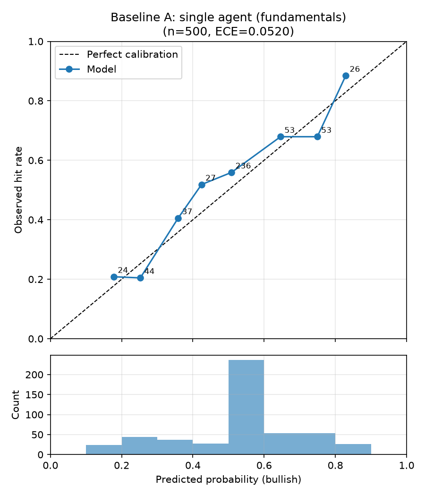
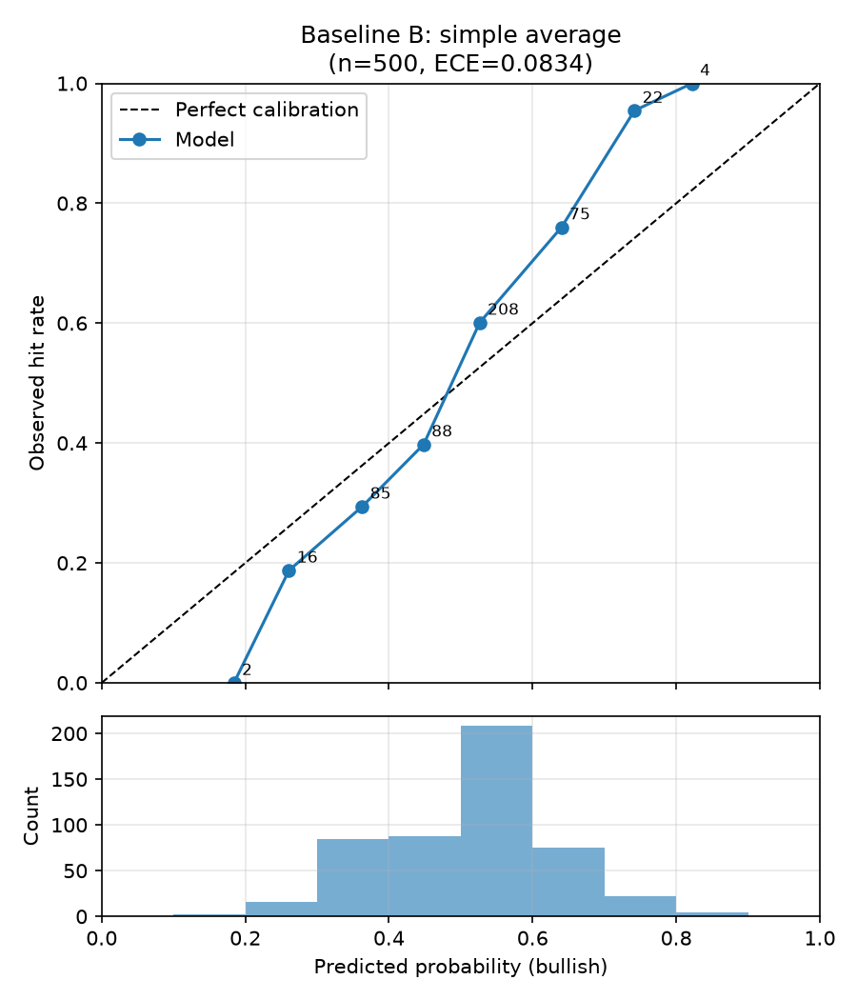

# 回測比較報表：合併策略比較（規格 6.3 + Agent 層級重新校準）

- 執行模式：`synthetic`
- 預測事件數：500（5 檔股票）
- Agent：fundamentals_agent, news_agent
- 期間：2023-01-02 ~ 2024-11-25
- LLM 判讀：未使用（規則式）
- 應驗判定：horizon 期末絕對報酬 > 0（20 個交易日，含息總報酬）

| 策略 | 平均 Brier ↓ | 方向準確率 ↑ | ECE ↓ | n(方向) |
|---|---|---|---|---|
| Baseline A：單一 Agent（財報） | 0.2233 | 0.688 | 0.0520 | 292 |
| Baseline B：簡單平均合併 | 0.2198 | 0.717 | 0.0834 | 300 |
| 本系統：精度加權合併 | 0.2193 | 0.719 | 0.0785 | 303 |
| 校準後簡單平均 | 0.2224 | 0.731 | 0.0853 | 283 |
| 校準後精度加權 | 0.2217 | 0.736 | 0.0939 | 280 |

### 個別 Agent（消融）

| Agent | 平均 Brier ↓ | ECE ↓ | 校準後 Brier ↓ | 校準後 ECE ↓ | 期末收縮係數 a | p ≠ 0.5 比例 | LLM 判讀比例 |
|---|---|---|---|---|---|---|---|
| fundamentals_agent | 0.2233 | 0.0520 | 0.2235 | 0.0450 | 0.96 | 58% | 0% |
| news_agent | 0.2418 | 0.0817 | 0.2401 | 0.0521 | 0.65 | 56% | 0% |

## 驗收標準（規格 6.3）

- 精度加權 Brier 優於兩個 baseline：✅ 通過
- 精度加權 ECE 不劣於兩個 baseline：❌ 未通過
- 校準後精度加權 Brier 優於校準後簡單平均：✅ 通過

## 校準曲線

## 備註

- Baseline A 的機率採規格 6.1 轉換；合併策略的機率為各 Agent 6.1 機率的
  加權線性意見池（權重同規格 5.2 合併公式）。
- 精度加權在回測初期（冷啟動，n<5）等同簡單平均，差異隨精度記錄累積浮現。